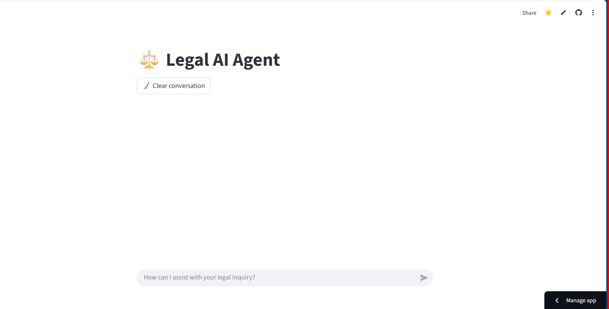

# ⚖️ Legal AI Agent

An intelligent agent developed with **Python** and **Streamlit**, designed to simulate a legal assistant.  
The project demonstrates expertise in **AI integration**, **data visualization**, and **web applications**, with emphasis on accessibility, organization, and user experience.

---

## 🚀 Key Highlights

- 🧠 **Artificial Intelligence**: Integration with OpenAI SDK and OpenRouter for natural language processing  
- 📊 **Data Visualization**: Interactive charts and statistics using Pandas and Plotly  
- 🌐 **Web Application**: Built with Streamlit for a modern, responsive interface  
- 🔒 **Secure Configuration**: Environment variables managed via `.env` and Streamlit Secrets  

---

## 🛠️ Technologies Used

- Python  
- Streamlit  
- Pandas  
- Plotly  
- OpenAI SDK  
- OpenRouter  
- Python Dotenv  


## 📁 Project Structure

Agente-IA-Juridico/ ├── .venv/ # Virtual environment (ignored by Git) ├── .env # API key and local settings ├── .gitignore # Ignored files and folders ├── requirements.txt # Project dependencies ├── streamlit_app.py # Main code of the legal agent └── README.md # Project documentation


## ⚙️ Local Installation and Execution

Create and activate the virtual environment:
```bash
python -m venv .venv
.venv\Scripts\activate  # Windows
Install dependencies:

bash
pip install -r requirements.txt
Run the app:

bash
streamlit run streamlit_app.py

📌 License and Disclaimer
This project is free to use for educational and experimental purposes. ⚠️ The content generated by the legal agent does not replace professional advice — always consult a qualified lawyer for legal decisions.


👨‍💻 Author
Leandro Timóteo Silva — Systems Analyst
**Analista de Sistemas:** Leandro Timóteo Silva  

- 📧 **E-mail:** [leandrinhots6@gmail.com](mailto:leandrinhots6@gmail.com)  
- 💼 **LinkedIn:** [linkedin.com/in/leandro-timóteo-ads](https://www.linkedin.com/in/leandro-timóteo-ads)  
- 📱 **WhatsApp:** [Enviar mensagem](https://wa.me/5583987830223)  

## 🎯 Visual Demonstration

### 📸 Legal Agent Interface  



> This interface allows users to interact with an AI-powered legal assistant.  
> It features a clean layout, conversation history, and a prompt field for legal inquiries.


## 🔗 Access the Legal AI Agent  
👉 [Launch the app](https://agente-ia-juridico-jtc2kzet7dikxxjvxsnhyz.streamlit.app/)


